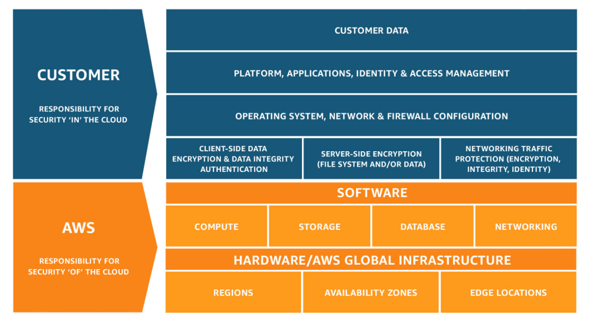

# AWS Practitioner Notes

# Cloud Computing

"The on-demand delivery of compute power, database storage, applications, and other IT resources" (pay-as-you-go)

Amazon Web Services owns and maintains the network-connected hardware required for these application services, while the client provisions and uses it via a web application (portal).

**Private Cloud:** (rockspace) Cloud services used/owned by a single organization, not exposed to the public. Complete control (provides security for sensitive applications) to meet specific buisness needs.

**Public Cloud:** (azure, google cloud, aws) Cloud resources owned and operated by a 3rd party cloud service provider delivered over the internet.

**Hybrid Cloud:** Keep some servers on premises and extend some capabilities to the cloud. Control over sensitive assets in pthe private infrastructure but maintain the flexibility and cost effectiveness of the public cloud.

### 5 characteristics of cloud computing:

1. **On-demand self service** allows users to provision resources and use them without human interaction from the service provider.
2. **Broad network access** allows resources to be accessed by diverse client platfroms.
3. **Multi-tenancy and resource pooling** enables multiple customers to access the same, shared, infrastructure and applications with security and privacy.
4. **Rapid elasticity and scalability** provides automatic and quick acquisition and disposure of resources when needed (quickly and easily scale based on demand).
5. **Measured service**, users pay exactly/correctly for what was used.

### 6 advantages of cloud computing:

1. **Trade capital expense (CAPEX) for operational expense (OPEX)** hardware is not owned and thereby reduce total cost of ownership.
2. **Benefit from massive economies of scale** price reduced as AWS is more efficient due to large scale usage/growth.
3. **Stop guessing capacity** scale based in actual measured usage.
4. **Increased speed and agility**
5. **Stop spending money running and maintaining data centres**
6. **Global coverage in minutes** leveraging AWS global infrastructure.

### Types of cloud computing:

**Infrastructure as a Service (IaaS)** provides the building blocks for cloud IT, networking, computers, data storage space, etc. with the highest level of flexibility (easy parallel with traditional on-premises IT). Amazon EC2 (on AWS), GCP, Azure, Rackspacem Digital Ocean, Linode, etc.

**Platform as a Service (PaaS)** removes the need for your organization to manage the underlying infrastructure, focusing on the deployment and managment of the applications. Elastic Beanstalk (on AWS), Heroku, Google App Engine (GCP), Windows Azure, etc.

**Software as a Service (SaaS)** has the service provider run and manage the completed product. Many AWS services (Rekognition for Machine Learning), Google Apps (Gmail), Dropbox, Zoom, etc.

# Amazon Web Services (AWS)

AWS **_Regions_** are clusters of data centres located all around the world, each with a unique name (us-east-1, eu-west-3, ...) specifying their location. Most AWS services are region-scoped. Choosing an AWS _Region_ can depend on: https://aws.amazon.com/about-aws/global-infrastructure/regional-product-services/

- **compliance** with data governance and legal requirements (data never leaves a region without explicity permission, etc.).
- **Proximity** to customers (reduce latency).
- **Service availability** within a _Region_ (new services/features may not be available in every _Region_).
- **Pricing** varies from _Region_ to _Region_ (transparent in the service pricing page).

Each _Region_ has [3-6] AWS **_Availability Zones_**; discrete data centres with redundant power, networking, and connectivity seperate from each other so they isolated from disasters/outages (prevents cascade from one _Availability Zone_ to another). Each _Region's_ _Availability Zones_ are connected with high bandwidth, ultra-low latency networking.

AWS **_Points of Presence_** (_Edge Locations_) allows the delivery of content to end users with lower latency.

### AWS Shared Responsibility Model

https://aws.amazon.com/compliance/shared-responsibility-model/

## Identity and Access Management (IAM) - Global service

Root account created by default, shouldn't be used or shared. A _User_ should be used instead. _Users_ are the people within an organization, and can blong to zero, one, or more _Groups_ (can only contain users, not other _Groups_).

_Users_ and/or _Groups_ can be assigned JSON documents called policies, describing the AWS permissions assigned by the Root. In AWS, **least privilege prinicple** is applied (users are given the least privilege required).
